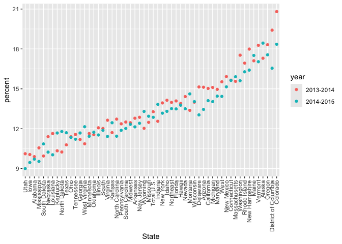
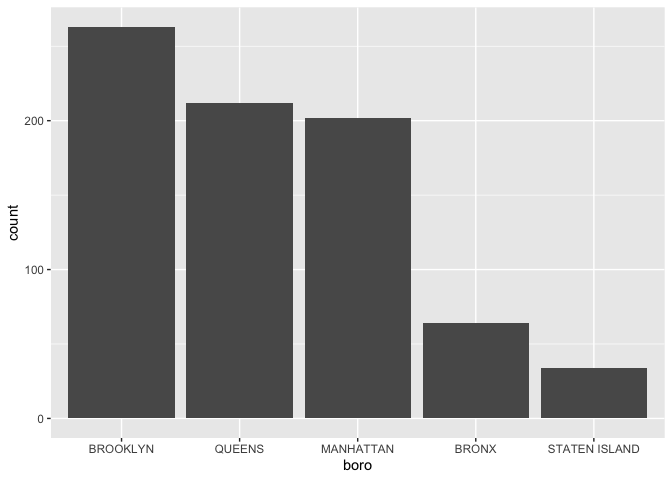
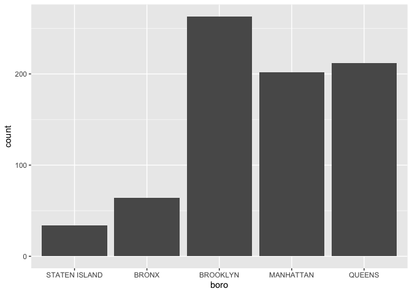

strings_and_factors
================
2024-10-16

Load necessary libraries

## Let’s do strings

``` r
string_vec=c("my", "name", "is", "jess")

str_detect(string_vec, "a")
```

    ## [1] FALSE  TRUE FALSE FALSE

``` r
str_detect(string_vec, "Jess")
```

    ## [1] FALSE FALSE FALSE FALSE

``` r
str_replace(string_vec, "jess", "Jeff")
```

    ## [1] "my"   "name" "is"   "Jeff"

``` r
str_replace(string_vec, "e", "E")
```

    ## [1] "my"   "namE" "is"   "jEss"

str_detect will tell us which ones has an “a” in it; it is case
sensitive and capitalized J will not be recognized. str_replace can
capitalize things

``` r
string_vec = c(
  "i think we all rule for participating",
  "i think i have been caught",
  "i think this will be quite fun actually",
  "it will be fun, i think"
  )
str_detect(string_vec, "i think")
```

    ## [1] TRUE TRUE TRUE TRUE

``` r
str_detect(string_vec, "^i think")
```

    ## [1]  TRUE  TRUE  TRUE FALSE

``` r
str_detect(string_vec, "i think^")
```

    ## [1] FALSE FALSE FALSE FALSE

if want to find one that STARTS with “i think”, put carrot in front (and
vice versa)

``` r
string_vec = c(
  "Time for a Pumpkin Spice Latte!",
  "went to the #pumpkinpatch last weekend",
  "Pumpkin Pie is obviously the best pie",
  "SMASHING PUMPKINS -- LIVE IN CONCERT!!"
  )

str_detect(string_vec, "pumpkin")
```

    ## [1] FALSE  TRUE FALSE FALSE

``` r
str_detect(string_vec, "Pumpkin")
```

    ## [1]  TRUE FALSE  TRUE FALSE

``` r
str_detect(string_vec,"[Pp]umpkin")
```

    ## [1]  TRUE  TRUE  TRUE FALSE

``` r
string_vec = c(
  '7th inning stretch',
  '1st half soon to begin. Texas won the toss.',
  'she is 5 feet 4 inches tall',
  '3AM - cant sleep :('
  )

str_detect(string_vec,"[0-9][a-z]")
```

    ## [1]  TRUE  TRUE FALSE FALSE

``` r
str_detect(string_vec, "^[0-9][a-zA-Z]")
```

    ## [1]  TRUE  TRUE FALSE  TRUE

pattern of number and then two letters. str_detect not detecting third
one bc number followed by a space

``` r
string_vec = c(
  'Its 7:11 in the evening',
  'want to go to 7-11?',
  'my flight is AA711',
  'NetBios: scanning ip 203.167.114.66'
  )

str_detect(string_vec, "7.11")
```

    ## [1]  TRUE  TRUE FALSE  TRUE

want “7 any character 11”. Dot is special bc matches anything

How things start to get real strange

``` r
string_vec = c(
  'The CI is [2, 5]',
  ':-]',
  ':-[',
  'I found the answer on pages [6-7]'
  )

str_detect(string_vec, "\\[")
```

    ## [1]  TRUE FALSE  TRUE  TRUE

What if we are looking for a special character like a bracket? \tells
that we are looking for bracket

\##Factors…

``` r
sex_vec= factor(c("male", "male", "female", "female"))
as.numeric(sex_vec)
```

    ## [1] 2 2 1 1

easy to mistake categorical variables/factor variables for string
variables, but factors give us a little more info

do some releveling…

``` r
sex_vec=fct_relevel(sex_vec, "male")

as.numeric(sex_vec)
```

    ## [1] 1 1 2 2

first putting male male first

## Revisit a lot of exampples

NSDUH

``` r
url = "http://samhda.s3-us-gov-west-1.amazonaws.com/s3fs-public/field-uploads/2k15StateFiles/NSDUHsaeShortTermCHG2015.htm"
drug_use_html = read_html(url)

drug_use_html
```

    ## {html_document}
    ## <html lang="en">
    ## [1] <head>\n<link rel="P3Pv1" href="http://www.samhsa.gov/w3c/p3p.xml">\n<tit ...
    ## [2] <body>\r\n\r\n<noscript>\r\n<p>Your browser's Javascript is off. Hyperlin ...

Get pieces actually need

``` r
marj_use_df=
drug_use_html |> 
  html_table() |> 
  first() |> 
  slice(-1) |> 
  select(-contains("P Value")) |> 
  pivot_longer(
    cols= -State,
    names_to = "age_year",
    values_to = "percent"
  ) |> 
  separate(age_year, into = c("age", "year"), sep = "\\(") |> 
  mutate(
    year=str_replace(year, "\\)", ""),
    percent=str_remove(percent, "[a-c]$"),
    percent=as.numeric(percent)
  )
```

after slice: get rid of p values, go from wide format to long format,
separate columns into two variables (age grp and year), also get rid of
a’s and b’s and c’s in the percentages and convert all numbers to
numeric variables.

Want plot of proportion of kids who responded YES in 2013, 2014, 2015
only among kids 12-17

``` r
marj_use_df |> 
  filter(age== "12-17") |> 
  mutate(
    State=fct_reorder(State, percent)
  ) |> 
  ggplot(aes(x=State, y=percent, color=year))+
  geom_point()+
  theme(axis.text.x = element_text(angle=90, vjust = 0.5, hjust = 1))
```

<!-- -->
fct_reorder statement we are saying we have this categorical variable
(State) and want to order it by percent

## NYC Restaurant Inspections

``` r
data("rest_inspec")

rest_inspec |> 
  slice(1:1000)
```

    ## # A tibble: 1,000 × 18
    ##    action          boro  building  camis critical_flag cuisine_description dba  
    ##    <chr>           <chr> <chr>     <int> <chr>         <chr>               <chr>
    ##  1 Violations wer… MANH… 425      4.15e7 Not Critical  Italian             SPIN…
    ##  2 Violations wer… MANH… 37       4.12e7 Critical      Korean              SHIL…
    ##  3 Violations wer… MANH… 15       4.11e7 Not Critical  Café/Coffee/Tea    CITY…
    ##  4 Violations wer… MANH… 35       4.13e7 Critical      Korean              MADA…
    ##  5 Violations wer… MANH… 1271     5.00e7 Critical      American            THE …
    ##  6 Violations wer… MANH… 155      5.00e7 Not Critical  Donuts              DUNK…
    ##  7 Violations wer… MANH… 1164     5.00e7 Critical      Salads              SWEE…
    ##  8 Violations wer… MANH… 37       4.12e7 Not Critical  Korean              SHIL…
    ##  9 Violations wer… MANH… 299      5.01e7 Not Critical  American            PRET…
    ## 10 Violations wer… MANH… 53       4.04e7 Not Critical  Korean              HAN …
    ## # ℹ 990 more rows
    ## # ℹ 11 more variables: inspection_date <dttm>, inspection_type <chr>,
    ## #   phone <chr>, record_date <dttm>, score <int>, street <chr>,
    ## #   violation_code <chr>, violation_description <chr>, zipcode <int>,
    ## #   grade <chr>, grade_date <dttm>

``` r
rest_inspec |> 
  count(boro, grade) |> 
  pivot_wider(
    names_from = grade,
    values_from = n
  )
```

    ## # A tibble: 6 × 8
    ##   boro              A     B     C `Not Yet Graded`     P     Z  `NA`
    ##   <chr>         <int> <int> <int>            <int> <int> <int> <int>
    ## 1 BRONX         13688  2801   701              200   163   351 16833
    ## 2 BROOKLYN      37449  6651  1684              702   416   977 51930
    ## 3 MANHATTAN     61608 10532  2689              765   508  1237 80615
    ## 4 Missing           4    NA    NA               NA    NA    NA    13
    ## 5 QUEENS        35952  6492  1593              604   331   913 45816
    ## 6 STATEN ISLAND  5215   933   207               85    47   149  6730

only going to look at ABC grades and get rid of missing boro info
(putting ! infront of function will do opposite )

``` r
rest_inspec=
  rest_inspec |> 
  filter(
    str_detect(grade, "[A-C]"),
    !(boro== "Missing")
  )
```

``` r
rest_inspec |> 
  mutate(dba=str_to_sentence(dba)) |> 
  filter(str_detect(dba, "Pizza"))
```

    ## # A tibble: 775 × 18
    ##    action          boro  building  camis critical_flag cuisine_description dba  
    ##    <chr>           <chr> <chr>     <int> <chr>         <chr>               <chr>
    ##  1 Violations wer… MANH… 151      5.00e7 Not Critical  Pizza               Pizz…
    ##  2 Violations wer… MANH… 151      5.00e7 Critical      Pizza               Pizz…
    ##  3 Violations wer… MANH… 151      5.00e7 Critical      Pizza               Pizz…
    ##  4 Violations wer… MANH… 15       5.01e7 Critical      Pizza               & Pi…
    ##  5 Violations wer… MANH… 151      5.00e7 Critical      Pizza               Pizz…
    ##  6 Violations wer… MANH… 151      5.00e7 Not Critical  Pizza               Pizz…
    ##  7 Violations wer… MANH… 15       5.01e7 Critical      Pizza               & Pi…
    ##  8 Violations wer… MANH… 151      5.00e7 Critical      Pizza               Pizz…
    ##  9 Violations wer… MANH… 84       5.00e7 Not Critical  Pizza               Pizza
    ## 10 Violations wer… MANH… 525      5.01e7 Not Critical  Pizza               Pizz…
    ## # ℹ 765 more rows
    ## # ℹ 11 more variables: inspection_date <dttm>, inspection_type <chr>,
    ## #   phone <chr>, record_date <dttm>, score <int>, street <chr>,
    ## #   violation_code <chr>, violation_description <chr>, zipcode <int>,
    ## #   grade <chr>, grade_date <dttm>

``` r
rest_inspec |> 
  mutate(dba=str_to_sentence(dba)) |> 
  filter(str_detect(dba, "Pizza")) |> 
  mutate(boro=fct_infreq(boro)) |> 
  ggplot(aes(x=boro))+
  geom_bar()
```

<!-- -->
fct_infreq tells to put boros in order of frequency

``` r
rest_inspec |> 
  mutate(dba=str_to_sentence(dba)) |> 
  filter(str_detect(dba, "Pizza")) |> 
  mutate(boro=fct_relevel(boro, "STATEN ISLAND")) |> 
  ggplot(aes(x=boro))+
  geom_bar()
```

<!-- -->
putting staten island first with relevel

``` r
rest_inspec |> 
  mutate(dba=str_to_sentence(dba)) |> 
  filter(str_detect(dba, "Pizza")) |> 
  mutate(boro=str_replace(boro, "MANHATTAN", "THE CITY"),
         boro=fct_infreq(boro)
         ) |> 
  ggplot(aes(x=boro))+
  geom_bar()
```

<!-- -->

``` r
rest_inspec |> 
  mutate(dba=str_to_sentence(dba)) |> 
  filter(str_detect(dba, "Pizza")) |> 
  mutate(boro=fct_infreq(boro),
         boro=fct_recode(boro, "THE CITY"= "MANHATTAN")
         ) |> 
  ggplot(aes(x=boro))+
  geom_bar()
```

<!-- -->
fct_recode does same thing as str_replace for changing Manhattan to The
City

One last thing on factors…

``` r
rest_inspec |> 
  mutate(dba=str_to_sentence(dba)) |> 
  filter(str_detect(dba, "Pizza")) |> 
  mutate(boro=fct_infreq(boro)) |> 
  lm(zipcode~boro, data= _)
```

    ## 
    ## Call:
    ## lm(formula = zipcode ~ boro, data = mutate(filter(mutate(rest_inspec, 
    ##     dba = str_to_sentence(dba)), str_detect(dba, "Pizza")), boro = fct_infreq(boro)))
    ## 
    ## Coefficients:
    ##       (Intercept)         boroQUEENS      boroMANHATTAN          boroBRONX  
    ##           11222.4              147.9            -1196.9             -761.2  
    ## boroSTATEN ISLAND  
    ##            -912.1
